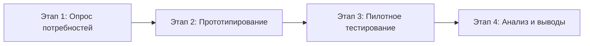

# 🎙️ Debatr

**Интеллектуальная веб-платформа для тренировки навыков дебатов и анализа аргументации с помощью ИИ**

  <a href="#-главные-материалы-и-документы">Материалы и файлы</a> •
  <a href="#-о-проекте">О проекте</a> •
  <a href="#-ключевые-возможности">Возможности</a> •
  <a href="#-рубрика-оценки">Рубрика оценки</a> •
  <a href="#-этапы-исследования">Этапы исследования</a> •
  <a href="#-команда-проекта">Команда</a>

---

## 📁 Главные материалы и документы проекта

Все ключевые материалы для экспертной оценки, жюри республиканского конкурса «Дарын» и ознакомления с исследовательской работой собраны в папках [`готовый_пакет_документов/`](готовый_пакет_документов/) и [`docs/`](docs/):

### 📊 1. Презентация и защита
* 📕 **[`Debatr.pdf`](готовый_пакет_документов/Debatr.pdf)** — официальный презентационный буклет и слайды научного проекта.
* 🎤 **[`docs/Питч_ИИ_дебаты.md`](docs/Питч_ИИ_дебаты.md)** — регламент выступления, структура питча и тезисы для защиты перед жюри.

---

### 📖 2. Тексты исследования для чтения онлайн (`.md`)
* 🔬 **[`docs/НАУЧНЫЙ_ПРОЕКТ_DEBATR.md`](docs/НАУЧНЫЙ_ПРОЕКТ_DEBATR.md)** — **полный текст научно-исследовательской работы**: титульные данные, аннотации на 3-х языках (RU, KZ, EN), Введение, Глава I (теория и модель Тулмина), Глава II (соцопрос $N=18$, архитектура, код и аналитика), Заключение и Список литературы.
* 📓 **[`docs/ДНЕВНИК_ИССЛЕДОВАТЕЛЯ_DEBATR.md`](docs/ДНЕВНИК_ИССЛЕДОВАТЕЛЯ_DEBATR.md)** — **дневник исследователя (зерттеуші күнделігі)**: хронологический протокол 3-х дней работы (опрос, критерии 0.0–9.0, кодинг платформы, пилот и замеры отклика).
* 📊 **[`docs/Анализ_опроса_дебатеров.md`](docs/Анализ_опроса_дебатеров.md)** — глубокий статистический разбор данных опроса дебатеров.
* 📋 **[`docs/survey_results.csv`](docs/survey_results.csv)** — сырые эмпирические данные респондентов ($N=18$).

---

### 📥 3. Официальные документы для скачивания и печати (`.docx`)
* 📄 **[`готовый_пакет_документов/НАУЧНЫЙ_ПРОЕКТ_DEBATR_ПОЛНЫЙ.docx`](готовый_пакет_документов/НАУЧНЫЙ_ПРОЕКТ_DEBATR_ПОЛНЫЙ.docx)** — **главный итоговый файл "все в одном"** (Титульный лист + Аннотации + Содержание + Полный исследовательский текст). Оформлен строго по стандартам конкурса «Дарын» (Times New Roman 14 pt, 1.5 интервал, поля 30/20/20/20 мм).
* 📓 **[`готовый_пакет_документов/Дневник_исследователя_DEBATR.docx`](готовый_пакет_документов/Дневник_исследователя_DEBATR.docx)** — официальный дневник исследователя (лаконичный формат на 1–2 страницы).
* 📑 **[`готовый_пакет_документов/Титульный_лист_и_Аннотация_DEBATR.docx`](готовый_пакет_документов/Титульный_лист_и_Аннотация_DEBATR.docx)** — титульный лист и 3 аннотации (RU, KZ, EN) отдельным файлом.
* 📑 **[`готовый_пакет_документов/Содержание_DEBATR.docx`](готовый_пакет_документов/Содержание_DEBATR.docx)** — табличное оглавление / мазмұны со страницами.
* 📑 **[`готовый_пакет_документов/ҒЫЛЫМИ_ЖОБА_DEBATR.docx`](готовый_пакет_документов/ҒЫЛЫМИ_ЖОБА_DEBATR.docx)** — основной исследовательский корпус работы.

---

### 📦 4. Полный комплект в одном архиве (`.rar`)
* 🗜️ **[`готовый_пакет_документов/DEBATR_НАУЧНЫЙ_ПРОЕКТ.rar`](готовый_пакет_документов/DEBATR_НАУЧНЫЙ_ПРОЕКТ.rar)** — единый официальный RAR-архив со всеми `.docx`, `.pdf` и `.md` файлами проекта.

---

## 📌 О проекте

На очных занятиях тренерам дебатных клубов приходится делить ограниченное время между всеми участниками. Из-за этого дебатерам часто не хватает регулярной индивидуальной обратной связи по каждому выступлению.

**Debatr** — это исследовательский проект и цифровая платформа, создаваемая для решения этой задачи. Платформа предоставляет интерактивную среду для самостоятельной практики, где дебатеры могут отрабатывать отдельные элементы речи, получать мгновенный предварительный разбор от ИИ по стандартизированной рубрике, а наставники — видеть узкие места учеников и прицельно готовить очные тренинги.

> [!NOTE]
> Обратная связь ИИ носит вспомогательный рекомендательный характер: итоговый контроль и валидация оценок остаются за наставником (модель *Human-in-the-Loop*).

---

## ✨ Ключевые возможности

| Возможность | Описание |
| :--- | :--- |
| 🎯 **Фокусные микро-упражнения** | Тренировка изолированных навыков: формулировка тезиса (claim), построение логической цепочки (warrant), подбор доказательств (data/impact) и структурирование речи. |
| 🛡️ **Отработка контраргументации** | Моделирование тезисов оппонента и тренировка оперативного опровержения (rebuttal). |
| 🤖 **ИИ-анализ по единой рубрике** | Предварительная диагностика речи с детализированными рекомендациями по улучшению каждого блока аргумента. |
| 👥 **Учебные раунды** | Проведение спаррингов с другими участниками клуба в синхронном или асинхронном формате. |
| 📊 **Панель наставника** | Сводная аналитика прогресса группы: типичные логические ошибки, динамика баллов и темы для разбора на уроках. |

---

## 📐 Рубрика оценки (Debatr Rubric)

Оценка аргументов вдохновлена международным форматом оценивания (шкала от **0.0 до 9.0** с шагом **0.5**) и разделена на 5 взаимодополняющих критериев:

| Критерий | Что оценивается |
| :--- | :--- |
| **1. Argument Structure** | Чёткость тезиса, логическая последовательность суждений, причинно-следственные связи. |
| **2. Evidence Quality** | Достоверность, релевантность фактов/примеров и глубина их привязки к доказательной базе. |
| **3. Rebuttal Effectiveness** | Точность попадания в аргумент соперника, выявление уязвимостей и сила контраргумента. |
| **4. Clarity & Coherence** | Ясность формулировок, структурированность речи, культура языка и отсутствие логических скачков. |
| **5. Originality & Insight** | Нестандартный угол рассмотрения темы, глубина анализа и весомость выводов. |

> [!TIP]
> Для каждого балла предусмотрены чёткие дескрипторы уровней (Rubric Bands), что обеспечивает прозрачность и объективность как для ИИ, так и для человека.

---

## 🔬 Этапы исследования

Проект сочетает педагогический эксперимент и разработку программного обеспечения:

1. **Этап 1. Выявление потребностей (Survey)**  
   Антервьюирование и анкетирование дебатеров через Google Формы для сбора актуальных болей, частоты тренировок и отношения к ИИ-ассистентам.
2. **Этап 2. Проектирование и разработка (Development)**  
   Создание веб-прототипа платформы со встроенными упражнениями, промпт-инжинирингом диагностической модели и личными кабинетами.
3. **Этап 3. Пилотная апробация (Pilot Testing)**  
   Формирование выборки участников, срез навыков "до", период систематической практики на платформе, срез навыков "после".
4. **Этап 4. Статистический анализ (Evaluation)**  
   Сравнение динамики дебатных навыков, расчёт степени согласованности оценок ИИ и наставника (*inter-rater reliability*), UX-анализ.

---

## 🔒 Этика, безопасность и ограничения

- **Добровольность:** Все опросы и участие в тестировании проводятся строго на добровольной основе с информированного согласия.
- **Приватность данных:** Личные данные участников обезличиваются и не передаются третьим сторонам.
- **Научная корректность:** Результаты пилота на ограниченной выборке интерпретируются как предварительные исследовательские наблюдения без необоснованного обобщения.
- **Вспомогательная роль ИИ:** Модель используется исключительно как тренажёр для самоподготовки, а не как замена живому общению с тренером и судьями.

---

## 👥 Команда проекта

- **Автор проекта:** Ихлас Мұстафа (10 «А» класс)
- **Научный руководитель:** Ақан Маратович

---

## 📂 Материалы репозитория

- [`README.md`](README.md) — паспорт и описание проекта.
- [`Питч_ИИ_дебаты.md`](Питч_ИИ_дебаты.md) — подробный питч и методологический план исследования.
- [`Debatr.pdf`](Debatr.pdf) — презентационные материалы и слайды проекта.