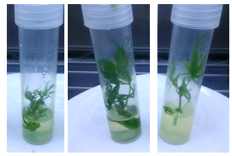
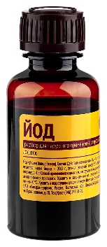
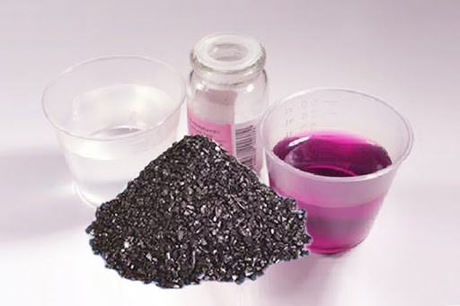
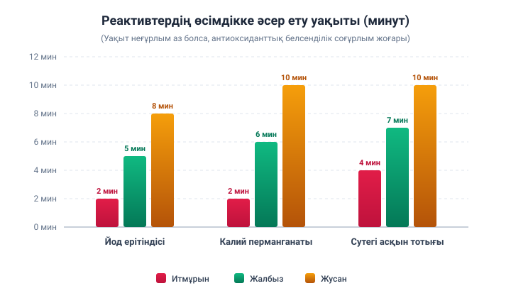

# Жергілікті өсімдіктердің дәрілік қасиеттері: халық медицинасы мен қазіргі ғылым арасындағы байланыс

---

## 📋 Титулдық мәліметтер

* **Білім ұйымы:** Маңғыстау облысы білім басқармасының Жаңаөзен қаласы бойынша білім бөлімінің «№13 Дарын мектеп-лицейі» КММ
* **Бағыты:** «Салауатты табиғи орта – Қазақстан-2030»
* **Секциясы:** Биология
* **Жоба тақырыбы:** «Жергілікті өсімдіктердің дәрілік қасиеттері: халық медицинасы мен қазіргі ғылым арасындағы байланыс»
* **Жоба авторлары:** Бисихан Аяна, Аманқызы Сағыныш (9-сынып оқушылары)
* **Ғылыми жетекшісі:** Базарбаева Айнұр Қожабаевна (биология мұғалімі, педагог-сарапшы)
* **Қала / Жыл:** Жаңаөзен қаласы, 2025 жыл

---

## 📌 Аннотация (Қазақ тілінде)

**Зерттеу жұмысының өзектілігі:** Табиғи өсімдіктерді тұрмыста және денсаулық сақтау саласында қолданудың артып келе жатқан сұранысымен айқындалады. Қазіргі заманда синтетикалық қоспалардың зияны жиі айтылып, экологиялық таза өнімдерге қызығушылық күшейіп отыр. Осы тұрғыдан алғанда дәстүрлі халықтық тәжірибе мен ғылыми әдістерді ұштастырудың маңызы зор.

**Зерттеудің мақсаты:** Өсімдік сығындыларының (итмұрын, жалбыз, жусан) антиоксиданттық және табиғи консерванттық қасиеттерін анықтап, оларды тағам өнімдерін сақтау процесінде қолдану мүмкіндігін бағалау.

**Гипотеза:** Дәрілік өсімдіктер құрамындағы биологиялық белсенді заттар тағамның сапасын сақтап, адамның ағзасына пайдалы әсерін тигізеді.

**Зерттеу кезеңдері:**
1. Әдебиеттерді зерделеу және халық тәжірибесіндегі деректерді жинақтау.
2. Өсімдіктерден тұнба, қайнатпа, сығынды дайындау.
3. Тәжірибелер жүргізу (итмұрын, жалбыз, жусан сығындыларын антиоксиданттық сынақтар мен тағамды сақтауда қолдану).
4. Нәтижелерді талдау және қорытынды жасау.

**Әдістері:** Әдеби шолу, салыстырмалы талдау, тәжірибелік-эксперименттік әдіс, бақылау.

**Зерттеудің жаңалығы:** Халықтық дәстүрді тәжірибелік жолмен дәлелдеу және оны қазіргі ғылыммен байланыстыра көрсету.

**Қорытынды:** Өсімдік негізіндегі табиғи өнімдердің тағам қауіпсіздігін арттыруға және экологиялық таза балама ұсынуға мүмкіндігі бар екені дәлелденді. Яғни, гипотеза толық расталды. Бұл зерттеу ғылым мен дәстүрді үйлестірудің өзектілігін айқындап, болашақта экологиялық мәселелерді шешуге үлес қосатынын көрсетті.

---

## 📌 Annotation (In English)

**Relevance:** The relevance of this research lies in the growing demand for the use of natural plants in everyday life and healthcare. Nowadays, the harmful effects of synthetic additives are increasingly emphasized, while interest in environmentally friendly products continues to rise. In this regard, the integration of traditional folk knowledge with modern scientific methods becomes highly significant.

**Aim of the study:** To determine the antioxidant and natural preservative properties of plant extracts (rosehip, mint, wormwood) and to assess their potential application in food preservation processes.

**Hypothesis:** Bioactive compounds contained in medicinal plants help preserve food quality and have beneficial effects on the human body.

**Research stages:**
1. Review of literature and collection of folk medicine data.
2. Preparation of infusions, decoctions, and extracts from plants.
3. Conducting experiments (antioxidant testing and using plant extracts in food preservation).
4. Analysis of results and drawing conclusions.

**Methods:** Literature review, comparative analysis, experimental method, observation.

**Scientific novelty:** Experimental confirmation of traditional folk practices and their correlation with modern science.

**Conclusion:** It was proven that plant-based natural products have the potential to enhance food safety and provide an eco-friendly alternative. That is, the hypothesis is confirmed. This research highlights the importance of integrating science with tradition and demonstrates its potential contribution to solving ecological problems in the future.

---

## 📑 Мазмұны

* [Кіріспе](#кіріспе)
* [І. Зерттеу бөлімі](#і-зерттеу-бөлімі)
  * [1.1 Жергілікті өсімдіктердің дәрілік қасиеттері](#11-жергілікті-өсімдіктердің-дәрілік-қасиеттері)
  * [1.2 Қазақстан флорасының көптүрлілігі](#12-қазақстан-флорасының-көптүрлілігі)
  * [1.3 Қазақ халқының шөппен емдеу дәстүрі](#13-қазақ-халқының-шөппен-емдеу-дәстүрі)
  * [1.4 Жалбыз, жусан және итмұрынның құрамы](#14-жалбыз-жусан-және-итмұрынның-құрамы)
  * [1.5 Өсімдіктің антиоксиданттық қасиетін тексеру](#15-өсімдіктің-антиоксиданттық-қасиетін-тексеру)
  * [1.6 Өсімдік сығындысының консерванттық және антибактериалды әсерін зерттеу](#16-өсімдік-сығындысының-консерванттық-және-антибактериалды-әсерін-зерттеу)
* [Қорытынды](#қорытынды)
* [Ұсыныстар](#ұсыныстар)
* [Пайдаланылған әдебиеттер тізімі](#пайдаланылған-әдебиеттер-тізімі)

---

## Кіріспе

Қазіргі заманда адам денсаулығын сақтау, дұрыс тамақтану және экологиялық тұрғыдан қауіпсіз өнімдерге қол жеткізу мәселесі ерекше маңызға ие болып отыр. Өндірісте тағамды ұзақ уақыт сақтауға арналған синтетикалық қоспалардың кеңінен қолданылуы адамдардың денсаулығына кері әсерін тигізуі мүмкін. Әртүрлі химиялық консерванттар аллергия тудыруы, ас қорыту жүйесіне зиян келтіруі немесе ағзада жиналып, созылмалы аурулардың дамуына ықпал етуі ықтимал. Сондықтан қазіргі таңда табиғи негіздегі, қауіпсіз әрі тиімді консерванттарды іздеу қажеттілігі артып келеді. Осы тұрғыдан алғанда, дәрілік өсімдіктердің құрамындағы биологиялық белсенді заттарды зерттеу өзекті ғылыми және практикалық міндеттердің бірі болып табылады.

Қазақстан флорасы аса бай әрі көптүрлілігімен ерекшеленеді. Бүгінгі күнге дейін 150-ден астам өсімдік түрі халықтық және ресми медицинада түрлі ауруларды емдеуде қолданылып келгені белгілі. Дәстүрлі тәжірибеде олар кеңінен пайдаланылғанымен, көптеген өсімдіктің нақты фармакологиялық әсері толық зерттелмеген. Халық емшілігі ғасырлар бойы қалыптасқан бай тәжірибеге сүйенеді. Мәселен, XV ғасырда өмір сүрген Өтейбойдақ Тілеуқабылұлының «Шипагерлік баян» атты еңбегінде жүздеген дәрілік өсімдік сипатталып, олардың шипалық қасиеттері көрсетілген. Бұл еңбектің ғылыми мәні – халықтың өсімдіктерді тұрмыста және ем-домда қолдану тәжірибесін жүйелеп, жазбаша мұра етіп қалдыруында [1].

### Зерттеудің өзектілігі
Бүгінгі таңда тағам өнімдерін сақтау мерзімін ұзарту үшін табиғи және экологиялық таза әдістерді қолдану – басты талаптардың бірі. Дүниежүзілік денсаулық сақтау ұйымы да тағам қауіпсіздігі мәселесін күн тәртібіне қойып отыр. Қазақстан жағдайында жергілікті өсімдіктердің дәрілік әрі консерванттық қасиеттерін ғылыми тұрғыдан зерттеу – халықтық тәжірибені заманауи ғылыммен ұштастырудың тиімді жолы.

### Зерттеудің мақсаты
Өсімдік сығындыларының (итмұрын, жалбыз, жусан) антиоксиданттық және табиғи консерванттық қасиеттерін анықтап, оларды тағам өнімдерін сақтау процесінде қолдану мүмкіндігін бағалау.

### Зерттеу міндеттері:
* Қазақстанда кең таралған дәрілік өсімдіктер туралы әдеби деректерге шолу жасау;
* Халықтық медицинада қолданылып келген шөптердің дәстүрлі тәжірибесін талдау;
* Өсімдік сығындыларының антиоксиданттық белсенділігін қарапайым тәжірибелер арқылы тексеру (йод, калий перманганаты, сутегі асқын тотығы әдістері);
* Өсімдік сығындыларының табиғи консерванттық әсерін анықтау мақсатында сүт пен суда жүргізілген тәжірибелер нәтижесін салыстыру;
* Алынған деректерді талдау арқылы өсімдіктердің тағам өнімдерін сақтау мерзімін ұзартудағы тиімділігін айқындау.

### Зерттеудің практикалық маңызы
Бұл жұмыстың нәтижелері халықтық білім мен заманауи ғылымды ұштастыра отырып, дәрілік өсімдіктерді күнделікті тұрмыста тиімді қолдануға жол ашады. Әсіресе, итмұрын сығындысының сүтті ұзақ сақтай алу қабілеті – оны тағам өнеркәсібінде экологиялық таза консервант ретінде қолдануға болатынын дәлелдейді.

Осылайша, өсімдіктердің консерванттық және антиоксиданттық қасиеттерін зерттеу – қазіргі ғылым мен білім үшін өзекті мәселе. Ол тек медицина мен тағамтану саласында ғана емес, ұлттық дәстүрлерді жаңғыртуда да маңызы зор бағыт болып табылады.

---

## І. ЗЕРТТЕУ БӨЛІМІ

### 1.1 Жергілікті өсімдіктердің дәрілік қасиеттері

Жергілікті өсімдіктердің дәрілік қасиеттерін зерттеу – халықтық медицина дәстүрінен басталып, қазіргі заманғы фармакологияға дейін созылатын ұзақ үдеріс. Қазақстан мен Орталық Азия аймағының флорасы биоәртүрлілігі мен эндемизміне бай; көптеген өсімдіктер халық арасында ғасырлар бойы емдік мақсатта қолданылып келеді. Соңғы онжылдықта осы дәстүрлі білімді заманауи химиялық және биологиялық әдістермен зерттеп, жаңа биологиялық белсенді заттарды айқындау белсенді түрде жүргізілуде. Бұл үрдіс халықтық тәжірибені ғылыми тұрғыдан тексеріп, қауіпсіз және тиімді табиғи препараттарды табуға мүмкіндік береді. 

Халықтық медицина – бұл өсімдіктерді емдік мақсатта қолданудың қоймасы [2]. Қазақстан аумағында бұл дәстүр көптеген ғасырларға сүйенеді; халық емшілігінің жазбаша деректері мен этнографиялық материалдар дәстүрлі рецептілер мен қолдану әдістерін сақтап қалған. Сонымен бірге, осы тәжірибелер көбіне өңірлік климат пен өсімдік ресурстарына байланысты қалыптасқан, сондықтан жергілікті флораны зерттеу ұлттық мәдени мұраны да ғылыми тұрғыда сақтауға мүмкіндік береді. Қазіргі заманғы этноботаникалық зерттеулер халықтық тәжірибені жүйелендіріп, оны фармакологиялық зерттеулерге берік база ретінде ұсынады.

Халықтық қолдану көбіне бай тәжірибеге сүйенсе де – өсімдіктердегі нақты белсенді компоненттер (фенолдар, флавоноидтар, эфир майлары, органикалық қышқылдар, дәрумендер және тағы басқалар) қазіргі ғылымның құралдарымен анықталғаннан кейін ғана фармакологиялық негізге ие болады. Артемизининнің (artemisinin) ашылуы – халықтық қолданудан басталған табыстың ең көрнекті мысалы: дәстүрлі қолданыс артемизияны (жусанды) зерттеуге жетелеп, қатты әсерлі малярияға қарсы препарат жасауға алып келді [3].

---

### 1.2 Қазақстан флорасының көптүрлілігі

Қазақстанның бай флорасы халықтық және ресми медицинада ерекше орын алады. Бүгінгі күнге дейін 150-ден астам өсімдік түрі халық арасында әртүрлі ауруларды емдеуде қолданылып келген. Дәстүрлі тәжірибеде кеңінен пайдаланылғанымен, олардың фармакологиялық белсенділігі жөнінде ғылыми деректер аз. Мәселен, жусаншөп және мақташөп секілді өсімдіктердің тері ауруларына қарсы әсері туралы деректер жеткіліксіз болғанымен, болашақ зерттеулер үшін әлеуеті зор екендігі байқалады.

Халық медицинасының тарихи тамырлары өте тереңде жатыр. XV ғасырда өмір сүрген Өтейбойдақ Тілеуқабылұлының «Шипагерлік баян» еңбегі қазақ халқының дәстүрлі емшілік тәжірибесін жүйелеп жазған құнды мұра болып саналады. Бұл еңбекте 700-ден астам өсімдік түрінің емдік қасиеттері, сондай-ақ жануарлардан, металдар мен минералдардан дайындалатын дәрілер туралы мәліметтер берілген. Сонымен бірге онда анатомиялық және медициналық терминдердің мол қоры жинақталып, қазақ тілінде ғылыми ұғымдардың қалыптасуына негіз қаланған [4].

Өтейбойдақ еңбегінің құндылығы тек халық медицинасымен шектелмей, қазіргі ғылыми ізденістерге де үндес келеді. Ол шөптердің ащы дәмін ас қорытуға пайдалы деп сипаттаса, бүгінгі зерттеулер мұны өсімдіктер құрамындағы эфир майлары мен түрлі биологиялық белсенді заттардың әсерімен байланыстырады. Сонымен қатар, шипагерлік дәстүрде қолданылған тұнба, қайнатпа, сығынды дайындау тәсілдері қазіргі фитотерапия ғылымында да кеңінен қолданылады. Бұл деректер қазақ халқының дәстүрлі тәжірибесі тәжірибелік сипаттан асып, ғылыми жүйеге жақындай түскенін көрсетеді.

Қазақстан флорасындағы өсімдіктердің ішінде жусан тұқымдасына жататын түрлердің зерттелуі ерекше мәнге ие. Мәселен, біржылдық жусаннан бөлініп алынған артемизинин заты бүгінде малярияға қарсы тиімді дәрілік компонент ретінде халықаралық деңгейде мойындалған. Бұл жаңалық тек жусанның ғана емес, жалпы Қазақстанда өсетін өсімдіктердің фармакологиялық әлеуетін айқындайды. Осылайша, халықтық тәжірибеден бастау алған білім қазіргі ғылыммен сабақтасып, жергілікті өсімдіктердің емдік қасиеттерін жаңа қырынан тануға мүмкіндік беріп отыр [5].

Соңғы жылдары тері ауруларын емдеуге бағытталған зерттеулер де қолға алынуда. Көкжалбызгүл өсімдігінің метанолды сығындысы бірнеше бактерияларға қарсы белсенділік танытқаны анықталды. Оның антибактериалды және антиоксиданттық қасиеттері бұл өсімдіктің тері ауруларын емдеуде қолданылу мүмкіндігін көрсетеді [6].

Жалпы алғанда, Қазақстанның жергілікті өсімдіктері халық медицинасында ғасырлар бойы тәжірибеден өткен құнды ресурс болып табылады. Дегенмен, олардың дәрілік қасиеттері туралы зерттеулер әлі де аз. Халықтық білім мен заманауи ғылымды ұштастыру арқылы өсімдіктердің фармакологиялық белсенділігін тереңірек анықтау, халық тәжірибесін ғылыми негізде дәлелдеу және жаңа дәрілік препараттар жасауға жол ашылады. Бұл тек медициналық тұрғыдан ғана емес, ұлттық мәдени мұраны сақтап, оны ғылыми тұрғыда әлемге танытудың да маңызды қадамы болып саналады.

---

### 1.3 Қазақ халқының шөппен емдеу дәстүрі

Қазақ халқы табиғатпен етене өмір сүріп, оның байлығын тұрмыс-тіршіліктің әр саласында пайдалана білген. Соның ішінде дәрілік өсімдіктер халық медицинасында ерекше орын алған. Дала жағдайында ем-дом жасау үшін қолжетімді құралдың бірі – шөп болғандықтан, ата-бабаларымыз өсімдіктердің емдік қасиетін ғасырлар бойы бақылап, тәжірибе жүзінде дәлелдеп, ұрпақтан-ұрпаққа жеткізген.

Әр өсімдіктің дәмі, иісі, түсі, пішіні мен әсеріне қарап, оның қандай ауруға шипа болатынын айқындайтын халықтық білім қалыптасқан. Бұл білімді жүйелеп, халық арасында таратқан адамдар «тәуіп», «емші» деп аталған. Емшілер дәрілік өсімдіктерді науқастың жасына, жағдайына, аурудың сипатына қарай қолдана білген.

**Шөптерді қолдану тәсілдері алуан түрлі болған:**
* **Қайнатпа мен тұнба** – асқазан, бүйрек, бауыр ауруларын емдеуде;
* **Жағар май мен тұндырма** – жара, ісік, тері ауруларына қарсы;
* **Бумен емдеу** – тыныс алу жүйесін жеңілдету үшін;
* **Шөп қоспалары** – жалпы ағзаны әлдендіру мақсатында пайдаланылған.

Мысалы, **жусан** – ас қорыту жүйесін жақсартуға және тәбетті ашуға, **жалбыз** – жөтелді жеңілдетуге, **түймедақ** – қабынуды басуға, **дермене** – ішек құрттарына қарсы қолданылған. **Жөке гүлі** ыстықты түсіруге, **итмұрын жемісі** дәрумен көзі ретінде пайдаланылады [7].

Қазақтар дәрілік өсімдіктерді тек ем үшін ғана емес, алдын алу мақсатында да пайдаланған. Шөп шайлары, хош иісті тұнбалар күнделікті тұрмыста жиі қолданылған. Бұл дәстүр халықтың денсаулықты сақтауға ұқыпты қарағанын көрсетеді.

Сонымен бірге, қазақ халқы табиғатты қастерлеп, өсімдікті ысырапсыз пайдаланған. «Даланың әрбір өсімдігі – халыққа шипа» деп бағалап, дәрілік шөптерді шамадан тыс жинамай, олардың келесі жылы қайта өсуіне мүмкіндік берген. Бұл экологиялық мәдениет – бүгінгі күн үшін де аса құнды тәжірибе. Қазақтың шөппен емдеу дәстүрі қазіргі ғылыми фитотерапияның негіздерімен үндес келеді. Бүгінде халық медицинасы арқылы сақталған көптеген тәжірибелер фармакология ғылымында дәлелденіп, ресми медицинада қолданыс тауып отыр.

---

### 1.4 Жалбыз, жусан және итмұрынның құрамы

Біз өз өңірімізде жиі кездесетін жалбыз, жусан және итмұрын өсімдіктерінің құрамын зерттеуді мақсат еттік. Бұл өсімдіктердің әрқайсысы қазақ халқының тұрмыс-тіршілігінде ерекше орын алған. Үлкендер мен ата-анамыз да үнемі олардың пайдасы туралы айтып отырады, ал қазіргі ғылымда да бұл өсімдіктердің қасиеті дәлелденгенін көріп жүрміз. Сондықтан мен өз зерттеуімде олардың құрамын талдап, халықтық тәжірибе мен ғылыми мәліметті салыстыруға тырыстық.

#### 1. Жалбыз (Mentha)
Жалбыздың құрамын қарастырғанда, ең алдымен оның эфир майлары мен ментол заты ерекше назар аудартты. Ментол – жалбызға тән хош иіс пен салқындық әсерін беретін негізгі компонент. Сонымен қатар жалбызда органикалық қышқылдар, С дәрумені және таниндер бар екен. Бұл заттар адам ағзасына сергіткіш, тынысты кеңейткіш, ас қорытуға көмектесетін әсер береді. Халық медицинасында жалбыз шайын ішіп, бас ауруын басқан немесе ас қорыту жүйесін реттеген. Ал қазіргі ғылым жалбыздағы ментолдың тыныс жолдарын кеңейтіп, жүйке жүйесін тыныштандыратынын дәлелдеп отыр. Өзім де жалбызды шайға қосып ішкенде, бойым жеңілдеп, көңіл-күйім көтерілетінін байқадық [8].

#### 2. Жусан (Artemisia)
Жусанның құрамында ащы заттар, эфир майлары, флавоноидтар және түрлі органикалық қосылыстар кездеседі. Оның иісі өткір, дәмі ащы болғанымен, ағзаға пайдалы әсері мол. Жусан халық медицинасында асқазан ауруларын емдеуге, тәбетті ашуға, микробтарға қарсы құрал ретінде қолданылған. Қазақ халқы жусанды үйге іліп қоятын болған, себебі ол ауаны тазартып, зиянды жәндіктерді қуады деп сенген. Ғылымда да жусанның құрамындағы ащы заттар ас қорыту бездерінің жұмысын жақсартып, микробтарға қарсы әсер ететіні анықталған. Өз тәжірибемізде мен жусан сығындысын сүтке қосқанда оның ашу процесін толық тоқтатпағанын көрдім, бірақ белгілі бір деңгейде баяулатты. Бұл оның құрамындағы заттардың микробтарға әлсіз болса да әсер ете алатынын көрсетті [9].

#### 3. Итмұрын (Rosa canina)
Итмұрын – қазақ халқы үшін ерекше бағалы өсімдік. Оның құрамында ең көп кездесетін зат – С дәрумені. Ғалымдар итмұрын жемісіндегі С дәруменінің мөлшері лимоннан бірнеше есе көп екенін айтады. Сонымен қатар оның құрамында пектиндер, органикалық қышқылдар, қанттар, каротин және флавоноидтар бар. Халық медицинасында итмұрын қайнатпасы суық тигенде, әлсірегенде, қан аздық кезінде кең қолданылған. Ал қазіргі ғылым итмұрынның иммунитетті күшейтіп, ағзаны түрлі инфекциялардан қорғауға көмектесетінін дәлелдеді. Өзімнің тәжірибемде итмұрын сығындысын сүтке қосқанда, ол ашу процесін айтарлықтай баяулатты, тіпті 24 сағаттан кейін де сүттің бұзылмағанын байқадым. Бұл оның табиғи консерванттық қасиетін айқын көрсетті.

Қорыта айтқанда, жалбыз, жусан және итмұрын – халық медицинасында ежелден қолданылып келе жатқан, әрі қазіргі ғылыммен де құндылығы дәлелденген өсімдіктер. Әрқайсысының өзіндік ерекше құрамы бар: жалбызда ментол мен эфир майлары, жусанда ащы заттар мен флавоноидтар, итмұрында мол мөлшерде С дәрумені. Бұл өсімдіктердің табиғи қасиеттерін зерттеу бізге олардың тұрмыстық және медициналық маңызын түсінуге мүмкіндік береді. Осындай тәжірибелер арқылы мен өсімдіктердің адам денсаулығы үшін қаншалықты маңызды екенін айқын сезіндік.

---

### 1.5 Өсімдіктің антиоксиданттық қасиетін тексеру

**Зерттеудің мақсаты:** Өсімдік сығындысының антиоксиданттық қасиетін анықтау.

Адам ағзасында әртүрлі биохимиялық реакциялар жүріп жатады. Соның ішінде бос радикалдардың түзілуі ағзаның қартаюына, әртүрлі аурулардың пайда болуына себеп болуы мүмкін. Антиоксиданттар – бұл зиянды бос радикалдардың әсерін бейтараптандыратын табиғи қосылыстар. Өсімдіктер құрамында флавоноидтар, фенолдық қосылыстар, дәрумендер сияқты антиоксиданттық заттар көптеп кездеседі [10]. Сол себепті өсімдіктердің антиоксиданттық белсенділігін зерттеу ғылыми тұрғыдан да, тұрмыстық қолданыс үшін де маңызды.

Зерттеудің ең басты артықшылығы – оның қарапайымдылығы. Жүргізу үшін күрделі құрал-жабдықтар мен қымбат реактивтер қажет емес, сондықтан оны мектеп жағдайында да оңай орындауға болады. Сонымен бірге, тәжірибе өсімдіктердің сырт көзге көрінбейтін биохимиялық қасиеттерін ашуға мүмкіндік береді. Тағы бір артықшылығы – бұл тәжірибе қазіргі замандағы ғылыми зерттеулермен тығыз байланысты. Өйткені өсімдіктердің антиоксиданттық белсенділігін зерттеу бүгінде медицина мен фармакология саласында кеңінен жүргізілуде. Демек, мектеп деңгейінде жасалған қарапайым тәжірибе де үлкен ғылыммен үндесіп, аталған тақырыпта зерттеу жүргізудің маңызды екенін көрсетеді.

Жұмысты орындау үшін алдымен зерттелетін өсімдіктерден сығынды алынды (1-сурет).

  
*1-сурет. Өсімдік сығындысы*

Ол үшін кептірілген өсімдік бөліктері (жапырақ, гүл, немесе тамыр) ұнтақталып, дистилденген су немесе этил спиртімен өңделді. Бірнеше сағат тұндырған соң сүзгі қағаз арқылы сығынды алынды.

Алынған сығындының антиоксиданттық белсенділігін тексеру үшін қарапайым реактивтер қолданылды: **йод ерітіндісі, калий перманганаты, сутегі асқын тотығы**. Әр өсімдіктің үлгісі реактивпен араластырылып, түстің өзгеруі бақылауға алынды.

1. **Йод ерітіндісімен сынақ.** Йод – күшті тотығу қасиеті бар зат. Егер өсімдік сығындысының құрамында антиоксиданттық заттар болса, олар йодты тотықсыздандырады. Мұндай жағдайда йодтың қоңыр түсі біртіндеп әлсірейді, ал кейде мүлдем жойылады. Бұл құбылысты күнделікті өмірде аскорбин қышқылын (С дәруменін) анықтауда жиі қолданады. Демек, өсімдік сығындысының йод түсін әлсірету деңгейіне қарап, оның құрамындағы антиоксиданттардың мөлшерін шамамен бағалауға болады.
2. **Калий перманганаты ($KMnO_4$) әдісі.** Калий перманганаты күлгін түсті ерітінді түзеді және ол да күшті тотықтырғыш болып саналады. Егер өсімдік сығындысы қосылса, оның құрамындағы фенолдар, флавоноидтар және дәрумендер $KMnO_4$-ті тотықсыздандырады. Соның нәтижесінде күлгін түс әлсіреп, ерітінді қоңырқай немесе түссіз күйге ауысады. Түстің өзгеру жылдамдығы мен қарқындылығы неғұрлым күшті болса, өсімдік сығындысының антиоксиданттық белсенділігі соғұрлым жоғары екенін білдіреді. Бұл әдістің артықшылығы – көрнекілігі және түс өзгерісінің айқын байқалуы.
3. **Сутегі асқын тотығы ($H_2O_2$) әдісі.** Сутегі асқын тотығы – табиғатта және тірі ағзаларда кездесетін күшті тотығу қасиеті бар қосылыс. Ол өсімдік сығындысымен әрекеттескенде көпіршік (оттек газы) бөледі. Егер өсімдік құрамында антиоксиданттық заттар мол болса, олар $H_2O_2$-нің тотығу әсерін әлсіретеді. Нәтижесінде көпіршіктің түзілуі баяулайды немесе мүлде тоқтайды, ал кей жағдайларда ерітінді түсі өзгереді. Бұл тәжірибе өсімдіктің бос радикалдарды бейтараптандыру қабілетін жанама түрде дәлелдеуге мүмкіндік береді.

Осы үш әдістің барлығында негізгі принцип бірдей – антиоксиданттық заттар күшті тотықтырғыштардың әсерін әлсіретеді немесе толық бейтараптандырады (2-сурет).

| а) Йод | ә) Калий перманганаты | б) Сутегі асқын тотығы |
|:---:|:---:|:---:|
|  |  |  |

*2-сурет. Антиоксиданттарды анықтауға арналған реагенттер: а) йод; ә) калий перманганаты; б) сутегі асқын тотығы*

Йод, калий перманганаты және сутегі асқын тотығы – қолжетімді әрі түс өзгерісі арқылы оңай бақыланатын реактивтер. Сол себепті оларды пайдалану өсімдік сығындыларының антиоксиданттық белсенділігін анықтаудың тиімді жолы болып табылады. Түстің қарқынды өзгеруі – өсімдік құрамында антиоксиданттық қосылыстардың көп екенін көрсетті. Нәтижелерді салыстыра отырып, ең жоғары антиоксиданттық белсенділік көрсеткен өсімдік анықталды (1-кесте).

#### 1-кесте. Антиоксиданттық қасиеттің деңгейі

| Әдіс | Жалбыз | Жусан | Итмұрын | Жалпы нәтиже |
| :--- | :--- | :--- | :--- | :--- |
| **Йод ерітіндісі** | Йод түсін әлсіретеді, кейде толық жояды → Орташа–жоғары | Йод түсін баяу әлсіретеді → Төмен | Йод түсін тез жояды → Жоғары | **Итмұрын > Жалбыз > Жусан** |
| **Калий перманганаты ($KMnO_4$)** | Күлгін түс тез жойылады → Жоғары | Күлгін түс баяу өзгереді → Төмен | Күлгін түс өте тез жойылады → Өте жоғары | **Итмұрын > Жалбыз > Жусан** |
| **Сутегі асқын тотығы ($H_2O_2$)** | Көпіршік аз түзіледі → Орташа–жоғары | Көпіршік баяу азаяды → Орташа | Көпіршік түзілуі мүлде тоқтайды → Жоғары | **Итмұрын > Жалбыз > Жусан** |

Жүргізілген тәжірибелер барысында әртүрлі өсімдіктердің сығындылары антиоксиданттық белсенділікке ие екені уақыт арқылы салыстырмалы түрде анықталды. Зерттеудің мақсаты – өсімдік құрамындағы жасырын биохимиялық заттардың әсерін қарапайым тәсілдермен бақылау болатын. Әр әдісте өсімдік сығындысы реактивпен әрекетке түскеннен кейінгі уақыт пен сыртқы өзгерістер мұқият жазылып отырды.

* **Алдымен йод ерітіндісімен тәжірибе жүргізілді.** Бұл әдісте итмұрын ең жоғары белсенділікті көрсетті: қоңыр түсті йод ерітіндісі 2–3 минутта толықтай түссізденді. Мұндай айқын нәтиже итмұрын құрамында дәрумендердің, әсіресе С дәруменінің мол екендігін дәлелдейді. Жалбыз сығындысы қосылған кезде түс біртіндеп әлсіреп, тек 5 минуттан кейін ғана айқын өзгеріс байқалды. Ал жусан жағдайында нәтиже әлсіз болды: ерітінді түсінің бәсеңдеуі 8–10 минуттан кейін ғана байқалды, оның өзі толық жойылған жоқ. Бұл жусан құрамындағы антиоксиданттық заттардың аз екенін көрсетеді.
* **Екінші сынақ – калий перманганаты әдісі.** Мұнда да итмұрын өз белсенділігін дәлелдеді. Күлгін түсті ерітінді небәрі 3 минутта толық түссізденді. Жалбызда түс өзгерісі 6 минутта орын алды, бірақ толық жоғалмай, әлсіреген күйде қалды. Жусан сығындысы қосылған кезде түс баяу өзгерді: тек 10 минуттан кейін ғана күлгін түс қоңырқай реңге ауысты. Бұл көрсеткіштер өсімдіктердің құрамындағы фенолдар мен флавоноидтардың әртүрлі деңгейде екенін аңғартады.
* **Үшінші сынақта сутегі асқын тотығы пайдаланылды.** Бұл реакцияда көпіршіктің түзілу уақыты бақыланды. Итмұрын қосылғанда көпіршік шамамен 4 минут ішінде толық тоқтады, яғни ол тотығу процесін айқын әлсіретті. Жалбызда көпіршіктің азаюы 7 минутта ғана байқалып, біршама уақытқа созылды. Ал жусанда көпіршік түзілуі 10 минутқа дейін жалғасты, бұл оның әлсіз антиоксиданттық белсенділігін көрсетті (2-кесте).

#### 2-кесте. Реактивтердің антиоксиданттық қасиетке әсері

| Реактив түрі | Итмұрын | Жалбыз | Жусан |
| :--- | :--- | :--- | :--- |
| **Йод ерітіндісі** | 2–3 минутта толық түссізденді, өте жоғары белсенділік | 5 минутта түс біртіндеп әлсіреді, орташа белсенділік | 8–10 минуттан кейін әлсіз өзгеріс, толық жойылмады |
| **Калий перманганаты ($KMnO_4$)** | 3 минутта толық түссізденді, жоғары белсенділік | 6 минутта түс әлсіреді, толық жоғалмады, орташа белсенділік | 10 минуттан кейін түс қоңырқайланды, төмен белсенділік |
| **Сутегі асқын тотығы ($H_2O_2$)** | 4 минутта көпіршік толық тоқтады, жоғары белсенділік | 7 минутта көпіршік баяулады, бірақ тоқтамады, орташа белсенділік | 10 минутқа дейін көпіршік түзілді, төмен белсенділік |

Жалпы алғанда, үш әдіс те бір-бірін толықтырып, нақты қорытынды жасауға мүмкіндік берді. Итмұрын барлық тәжірибеде ең жылдам және айқын нәтиже көрсетті. Демек, оның антиоксиданттық белсенділігі өте жоғары. Жалбыз орташа деңгейде нәтиже беріп, пайдалы қасиеттерінің бар екенін дәлелдеді. Ал жусан ең баяу және әлсіз өзгерістерді көрсетті, сондықтан оның антиоксиданттық белсенділігі төмен деп айтуға болады (3-сурет).

  
*3-сурет. Реактивтер арқылы өсімдік антиоксидантын анықтау уақыты (минут бойынша)*

Бұл зерттеу өсімдіктердің сырт көзге байқала бермейтін қасиеттерін қарапайым әдістер арқылы анықтауға болатындығын дәлелдеді. Итмұрын мен жалбыздың жоғары белсенділігі олардың қазақ дәстүрлі медицинасы мен қазіргі ғылымдағы маңызын бекіте түседі. Ал жусанның төмендеу көрсеткіші оның басқа емдік қасиеттерімен толықтырылуы мүмкін екенін еске салады.

Бұл тәжірибелерді орындау бізге ғылымға деген қызығушылықты арттырды. Қарапайым өсімдіктердің құрамында осындай маңызды заттар бар екенін көріп, олардың табиғаттағы және адам өміріндегі орнына жаңаша қарадым. Болашақта осындай тәжірибелерді кеңейтіп, басқа да өсімдіктерді зерттеп көргім келеді.

---

### 1.6 Өсімдік сығындысының консерванттық және антибактериалды әсерін зерттеу

Бұл зерттеудің негізгі мақсаты – өсімдік сығындыларының күнделікті қолданылатын заттарға тигізетін әсерін бақылау арқылы олардың табиғи консерванттық және антибактериалды қасиеттерін айқындау. Қазіргі таңда тағам өнімдерін сақтау үшін көбіне химиялық қоспалар пайдаланылады. Алайда табиғи өсімдік негізіндегі заттарды қолдану адам денсаулығы үшін пайдалы әрі экологиялық таза әдіс болып саналады.

**Зерттеу міндеттері төмендегідей болып айқындалды:**
* Өсімдік сығындыларын әртүрлі сұйық заттармен (су және сүтпен) араластыру;
* 24 сағат бойы олардың түс, иіс, құрылым өзгерістерін бақылап, салыстыру;
* Алынған нәтижелерді талдау арқылы өсімдіктердің табиғи консервант ретіндегі мүмкіндігін бағалау.

Зерттеуде қолданылған материалдар мен құралдар да қарапайым әрі қолжетімді болды. Негізгі зерттелген үлгілер – итмұрын, жалбыз және жусан өсімдіктерінің судағы сығындылары. Олар тәжірибе барысында сұйық заттарға қосылып, әсері бақыланды (3-кесте).

#### 3-кесте. Өсімдік пен сұйықтықтың ара қатынасы

| № | Өсімдік сығындысы (судағы) | Қосылған сұйықтық түрі | Қатынас | Жалпы көлемі |
|:---:| :--- | :--- |:---:|:---:|
| 1 | Итмұрын сығындысы – 2 мл | Сүт – 8 мл | 1:4 | 10 мл |
| 2 | Жалбыз сығындысы – 2 мл | Сүт – 8 мл | 1:4 | 10 мл |
| 3 | Жусан сығындысы – 2 мл | Сүт – 8 мл | 1:4 | 10 мл |
| 4 | Итмұрын сығындысы – 2 мл | Су – 8 мл | 1:4 | 10 мл |
| 5 | Жалбыз сығындысы – 2 мл | Су – 8 мл | 1:4 | 10 мл |
| 6 | Жусан сығындысы – 2 мл | Су – 8 мл | 1:4 | 10 мл |

Сонымен қатар сынақ жүргізу үшін сүт, су және шыны ыдыстар пайдаланылды. Әр кезеңдегі өзгерістерді дәл тіркеу үшін таймер немесе сағат қолданылып, бақылау жазбалары арнайы дәптерге жазылып отырды.

**Тәжірибе жүргізу кезеңдері:**
1. Әр өсімдіктің сығындысы дайындалады (қайнатпа түрінде).
2. Әр өсімдік сығындысы бөлек ыдыста сүтке және суға қосылады.
3. Салыстыру үшін бақылау үлгілері алынады (өсімдік сығындысы қоспай).
4. 24 сағат бойы әр 6 сағат сайын түс, иіс, пішін өзгерістері бақыланып жазылады (4 және 5-кестелер).

#### 4-кесте. Су ортасында өсімдік сығындысының әсері

| Өсімдік сығындысы | 0 сағат (бастапқы) | 6 сағат | 12 сағат | 24 сағат | Қорытынды |
| :--- | :--- | :--- | :--- | :--- | :--- |
| **Итмұрын** | Ашық қоңыр түс, әлсіз хош иіс | Өзгеріс жоқ | Сәл қоңырлау | Түс тұрақты, иісі сақталды | Суда ұзақ сақталады, тұрақты |
| **Жалбыз** | Жасыл реңді, иісі айқын | Иіс күшейді | Түс аздап сарғайды | Иіс азайды, бірақ өзгеріс шамалы | Орташа тұрақтылық |
| **Жусан** | Қаралау рең, ащы иіс | Иіс тұрақты | Сәл тұнба түсті | Суында ащы дәм сақталды, иісі сол күйінде | Консерванттық әсері бар |

#### 5-кесте. Сүт ортасында өсімдік сығындысының әсері

| Өсімдік сығындысы | 0 сағат (бастапқы) | 6 сағат | 12 сағат | 24 сағат | Қорытынды |
| :--- | :--- | :--- | :--- | :--- | :--- |
| **Итмұрын** | Ақ түсті сүт, иіссіз | Өзгеріс жоқ | Сәл қышқыл иіс | Қышқылдану баяу, ірімшік түзілуі әлсіз | **Антибактериалды әсері бар, сүтті ұзақ сақтайды** |
| **Жалбыз** | Сүт түсі сәл жасылдау | Иіс хош | 12 сағатта қышқыл иіс шықты | 24 сағатта ашу айқын | **Орташа әсер, сақтау мерзімі сәл ұзартылды** |
| **Жусан** | Сүттің иісі өзгеше | Қышқылдау байқалды | 12 сағатта қоюлана бастады | 24 сағатта толық ашыды | **Консерванттық қасиеті төмен** |

#### Тәжірибе нәтижелерін талдау
Жүргізілген тәжірибелер нәтижесінде өсімдік сығындыларының сұйық заттарға әртүрлі әсер ететіні анық байқалды. Әсіресе, өсімдік сығындысы қосылған үлгілерді су және сүт ортасында салыстыру айқын айырмашылық берді:

1. **Су ортасында** барлық өсімдік сығындылары тұрақты сақталып, түсі мен иісінде елеулі өзгеріс байқалмады. Бұл өсімдік сығындыларының судағы бейтарап қасиетке ие екенін және микроағзалардың дамуын едәуір тежей алатынын көрсетті.
2. **Сүт ортасында** тәжірибе мүлде басқа нәтиже берді. Сүт – тез ашып кететін өнім, сондықтан ол өсімдік сығындыларының консерванттық әсерін анықтауға ыңғайлы орта болды. Мұнда ең жоғары тұрақтандырушы қасиетті **итмұрын сығындысы** көрсетті: 24 сағат бойы сақталған үлгіде толық ашу процесі жүрмеді, яғни сүт өзінің бастапқы қасиеттерін айтарлықтай ұзақ сақтап қалды. Бұл итмұрын құрамындағы аскорбин қышқылы (С дәрумені), органикалық қышқылдар мен фенолдық қосылыстардың мол болуымен байланысты. Олар сүттегі ашу процесін тудыратын микроағзалардың белсенділігін тежеп, табиғи консервант қызметін атқарды.
3. **Жалбыз сығындысының әсері** орташа деңгейде болды. 24 сағаттан кейін сүттің ашу процесі бәсеңдегенімен, ол толық тоқтаған жоқ. Дегенмен жалбыз құрамындағы эфир майлары мен флавоноидтар сүттің бұзылуын баяулатып, микробтарға қарсы әсер көрсеткені анық байқалды.
4. **Жусан жағдайында** нәтиже әлсіз шықты. Бұл өсімдіктің антисептикалық қасиеттері бар болғанымен, оның сүтке қосылған шағын мөлшері ашу процесін тоқтатуға жеткіліксіз болды. 24 сағат ішінде сүт ашып, иісі мен дәмі өзгерді. Бұл көрсеткіш жусанның басқа жағдайларда (мысалы, дәрілік немесе паразитке қарсы құрал ретінде) тиімді екенін, бірақ тағамды ұзақ мерзімге сақтауда әлсіз екенін аңғартады.

Жалпы алғанда, бұл зерттеу өсімдік сығындыларын табиғи консервант ретінде қолданудың тиімділігін нақты дәлелдеп берді. Әсіресе, итмұрын сығындысы тағам өнімдерінің сақтау мерзімін ұзартуда ерекше нәтиже көрсетті. Қазіргі таңда синтетикалық қоспаларға тәуелді болмай, экологиялық таза, қауіпсіз әдістерді пайдалану қажеттілігі артып отырғаны белгілі. Осы тұрғыдан қарағанда, зерттеу нәтижелері тағам өнеркәсібінде, халық медицинасында және тұрмыстық жағдайда қолдануға болатындай құнды ақпарат береді.

---

## Қорытынды

Бұл зерттеу жұмысының негізгі мақсаты – жергілікті өсімдіктердің (жалбыз, жусан, итмұрын) құрамындағы пайдалы заттарды қарапайым тәжірибелер арқылы анықтап, олардың халық медицинасындағы қолданысын қазіргі ғылыми деректермен салыстыру болды. Осы мақсатқа сәйкес бірнеше міндеттер алға қойылды: өсімдіктердің құрамын сипаттау, оларды түрлі ортаға қосып тәжірибе жасау, нәтижелерді уақыт арқылы салыстыра отырып талдау және олардың консерванттық, антибактериалды қасиеттерін бағалау.

Жүргізілген зерттеу нәтижелері бұл міндеттердің толық орындалғанын көрсетті:
1. Тәжірибелерде өсімдік сығындыларының су мен сүтке әсері бақыланды. Су ортасында айтарлықтай өзгеріс болмағанымен, сүтте **итмұрын ең жоғары тұрақтандырушы әсер көрсетті**: 24 сағаттан кейін де ашу процесі толық жүрмеді. Жалбыз орташа нәтиже берді, ал жусанның әсері әлсіз болды. Бұл мәліметтер өсімдіктердің табиғи консервант ретіндегі мүмкіндігін айқын дәлелдеді.
2. Жалпы алғанда, зерттеу жұмысының мақсатына толық жеттік. Жоспарланған міндеттердің барлығы орындалды: өсімдіктердің құрамы зерттелді, тәжірибелер жүргізілді, нәтижелер салыстырылды және ғылыми тұрғыда түсіндірілді. Оқушы ретінде бізге осындай зерттеу жасау үлкен тәжірибе болды: табиғаттың жасырын байлығын зерттеп қана қоймай, оны ғылыми тілде түсіндіруді үйрендік.
3. Қорыта айтқанда, жалбыз, жусан және итмұрын – халқымыздың тұрмысында кеңінен қолданылған өсімдіктер. Олардың дәрілік қасиеттері қазіргі ғылыми әдістермен де дәлелденіп отыр. Әсіресе, итмұрынның антиоксиданттық және консерванттық қабілеті ерекше көзге түсті. Бұл зерттеу табиғи өсімдіктердің маңызын қайта бағалап, оларды күнделікті өмірде тиімді қолдануға болатынын көрсетеді.
4. Зерттеу нәтижесінде жусан, жалбыз және итмұрын өсімдіктерінің антиоксиданттық қасиеттерге ие екендігі дәлелденді. Халық медицинасында бұл өсімдіктердің кеңінен қолданылуы олардың биологиялық белсенді қосылыстарға бай екендігін көрсетеді.
5. Жүргізілген тәжірибелер өсімдік экстрактілерінің тотығуға қарсы әсерін көрсетті, бұл олардың құрамында флавоноидтар, фенолдар, аскорбин қышқылы (С дәрумені) сияқты табиғи антиоксиданттардың бар екенін дәлелдейді.
6. Итмұрынның антиоксиданттық белсенділігі ең жоғары болды, себебі оның құрамында С дәрумені көп мөлшерде кездеседі. Жусан мен жалбыз да айтарлықтай белсенділік көрсетті.

---

## 💡 Ұсыныстар

1. Оқушылар мен жастарға арналған биология үйірмелерінде осындай жергілікті өсімдіктерді зерттеу арқылы зертханалық жұмыс дағдыларын дамытуға арналған әдістемелік көмекші құралдар шығару ұсынылады.
2. Бұл өсімдіктерді мектеп дәріханасында кептіріп сақтап, емдік шөптер бұрышы ретінде таныстыру ұсынылады.
3. Болашақта өсімдіктердің тек антиоксиданттық емес, бактерияға қарсы немесе қабынуға қарсы қасиеттерін де зерттеу қажет.
4. Итмұрын, жусан, жалбыз негізінде табиғи шайлар, бальзамдар немесе биоқоспалар, биопрепараттар жасау идеясы ұсынылады.

---

## 📚 Пайдаланылған әдебиеттер тізімі

1. Жұмабаев Ә., Сейітов М. Өсімдіктердің дәрілік қасиеттері. – Алматы : Білім, 2018. – 220 б.
2. Сәрсенбаева Қ. Қазақ халқының дәстүрлі шипагерлігі. – Алматы : Қазақ университеті, 2015. – 180 б.
3. Арыстанова Н.Э., Бекмырза А.Т. Антимикробные свойства растительных экстрактов // Вестник КазНУ. Серия биологическая. – 2020. – Т. 79. – №1. – С. 55–62.
4. Омаров Ә. Дәрілік өсімдіктер және халық емшілігі. – Алматы : Рауан, 2012. – 256 б.
5. Ержанова А.Б. Қазақстан флорасының дәрілік өсімдіктері. – Алматы : Ғылым, 2017. – 312 б.
6. WHO. Traditional medicine [Электрон. ресурс]. – Қолжетімді режим: [https://www.who.int/health-topics/traditional-medicine](https://www.who.int/health-topics/traditional-medicine) (қол жеткізген күні: 01.09.2025).
7. Harborne J.B. Phytochemical methods: A guide to modern techniques of plant analysis. – 3rd ed. – London : Chapman and Hall, 1998. – 302 p.
8. Дәрібаев С., Жүнісова Л. Дәстүрлі шипагерлік негіздері. – Шымкент : ОҚМУ баспасы, 2014. – 198 б.
9. Поляков В.А. Лекарственные растения и их применение в народной медицине. – Москва : Колос, 2015. – 280 с.
10. Громова О.А., Торшин И.Ю. Фитотерапия: современные аспекты применения. – Москва : ГЭОТАР-Медиа, 2019. – 352 с.