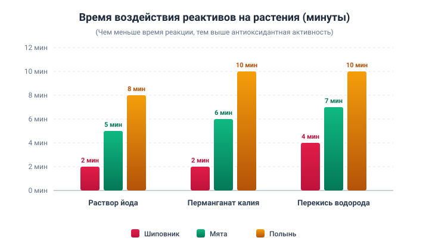

# Лекарственные свойства местных растений: связь народной медицины и современной науки

---

## 📋 Титульные данные

* **Образовательное учреждение:** КГУ «Школа-лицей №13 Дарын» отдела образования по городу Жанаозен управления образования Мангистауской области
* **Направление:** «Здоровая природная среда – Казахстан-2030»
* **Секция:** Биология
* **Тема проекта:** «Лекарственные свойства местных растений: связь народной медицины и современной науки»
* **Авторы проекта:** Бисихан Аяна, Аманкызы Сагыныш (учащиеся 9 класса)
* **Научный руководитель:** Базарбаева Айнур Кожабаевна (учитель биологии, педагог-эксперт)
* **Город / Год:** г. Жанаозен, 2025 год

---

## 📌 Аннотация (на русском языке)

**Актуальность исследования:** Определяется растущим спросом на использование природных растений в быту и сфере здравоохранения. В настоящее время всё чаще поднимается вопрос о вреде синтетических добавок и усиливается интерес к экологически чистым продуктам. В этой связи объединение традиционного народного опыта и научных методов имеет огромное значение.

**Цель исследования:** Определить антиоксидантные и природные консервирующие свойства растительных экстрактов (шиповника, мяты, полыни) и оценить возможность их применения в процессах сохранения пищевых продуктов.

**Гипотеза:** Биологически активные вещества, содержащиеся в лекарственных растениях, сохраняют качество продуктов питания и оказывают благотворное влияние на организм человека.

**Этапы исследования:**
1. Изучение литературы и обобщение данных народного опыта.
2. Приготовление настоев, отваров и экстрактов из растений.
3. Проведение серии экспериментов (определение антиоксидантной активности и применение растительных экстрактов для консервации продуктов).
4. Анализ полученных результатов и формулирование выводов.

**Методы исследования:** Литературный обзор, сравнительный анализ, экспериментально-опытный метод, наблюдение.

**Научная новизна:** Экспериментальное подтверждение народных традиций и их сопоставление с современными научными данными.

**Заключение:** Доказано, что натуральные продукты на растительной основе способны повысить безопасность пищевых продуктов и служить экологически чистой альтернативой синтетическим добавкам. Таким образом, гипотеза полностью подтвердилась. Данное исследование подчеркивает актуальность интеграции науки и традиций, а также вносит вклад в решение экологических задач.

---

## 📌 Annotation (In English)

**Relevance:** The relevance of this research lies in the growing demand for the use of natural plants in everyday life and healthcare. Nowadays, the harmful effects of synthetic additives are increasingly emphasized, while interest in environmentally friendly products continues to rise. In this regard, the integration of traditional folk knowledge with modern scientific methods becomes highly significant.

**Aim of the study:** To determine the antioxidant and natural preservative properties of plant extracts (rosehip, mint, wormwood) and to assess their potential application in food preservation processes.

**Hypothesis:** Bioactive compounds contained in medicinal plants help preserve food quality and have beneficial effects on the human body.

**Research stages:**
1. Review of literature and collection of folk medicine data.
2. Preparation of infusions, decoctions, and extracts from plants.
3. Conducting experiments (antioxidant testing and using plant extracts in food preservation).
4. Analysis of results and drawing conclusions.

**Methods:** Literature review, comparative analysis, experimental method, observation.

**Scientific novelty:** Experimental confirmation of traditional folk practices and their correlation with modern science.

**Conclusion:** It was proven that plant-based natural products have the potential to enhance food safety and provide an eco-friendly alternative. That is, the hypothesis is confirmed. This research highlights the importance of integrating science with tradition and demonstrates its potential contribution to solving ecological problems in the future.

---

## 📑 Содержание

* [Введение](#введение)
* [I. Исследовательская часть](#i-исследовательская-часть)
  * [1.1 Лекарственные свойства местных растений](#11-лекарственные-свойства-местных-растений)
  * [1.2 Разнообразие флоры Казахстана](#12-разнообразие-флоры-казахстана)
  * [1.3 Традиции траволечения казахского народа](#13-традиции-траволечения-казахского-народа)
  * [1.4 Состав мяты, полыни и шиповника](#14-состав-мяты-полыни-и-шиповника)
  * [1.5 Проверка антиоксидантных свойств растений](#15-проверка-антиоксидантных-свойств-растений)
  * [1.6 Исследование консервирующего и антибактериального действия экстрактов](#16-исследование-консервирующего-и-антибактериального-действия-экстрактов)
* [Заключение](#заключение)
* [Рекомендации](#рекомендации)
* [Список использованной литературы](#список-использованной-литературы)

---

## Введение

В современную эпоху вопросы сохранения здоровья человека, правильного питания и доступа к экологически безопасным продуктам приобретают первостепенное значение. Широкое применение в пищевой промышленности синтетических добавок, предназначенных для длительного хранения продуктов, может оказывать негативное воздействие на организм человека. Различные химические консерванты способны провоцировать аллергические реакции, нарушать функционирование органов пищеварения или накапливаться в организме, способствуя развитию хронических заболеваний. Поэтому поиск безопасных и эффективных консервантов на природной основе становится все более насущной потребностью. В связи с этим изучение биологически активных соединений лекарственных растений представляет собой актуальную научную и практическую задачу.

Флора Казахстана отличается исключительным богатством и разнообразием. Известно, что свыше 150 видов растений издревле применялись в народной и официальной медицине для лечения различных недугов. Несмотря на их широкое применение в традиционной практике, точный фармакологический механизм действия многих растений до сих пор изучен не до конца. Народная медицина опирается на многовековой практический опыт. Например, в труде известного казахского врачевателя XV века Отебойдака Тлеукабылулы «Шипагерлик баян» описаны сотни лекарственных растений и их целебные свойства. Научная ценность этого труда заключается в систематизации народных знаний по использованию трав в быту и лечении и закреплении их в письменном наследии [1].

### Актуальность исследования
Применение природных и экологически чистых методов для продления сроков хранения пищевых продуктов сегодня является одним из ключевых требований. Всемирная организация здравоохранения также выдвигает проблему безопасности пищевых продуктов на передний план. В условиях Казахстана научное исследование лекарственных и консервирующих свойств местных растений представляет собой эффективный путь интеграции традиционных народных знаний с современной наукой.

### Цель исследования
Определить антиоксидантные и природные консервирующие свойства растительных экстрактов (шиповника, мяты, полыни) и оценить возможность их практического применения для сохранения качества пищевых продуктов.

### Задачи исследования:
* Провести аналитический обзор научной литературы о лекарственных растениях, распространенных в Казахстане;
* Изучить и проанализировать опыт традиционной народной медицины по применению целебных трав;
* Экспериментально проверить антиоксидантную активность экстрактов исследуемых растений доступными методами (с использованием раствора йода, перманганата калия и перекиси водорода);
* Сравнить консервирующее действие экстрактов в водной и молочной средах;
* На основе полученных данных выявить наиболее эффективные растительные экстракты для продления срока годности пищевых продуктов.

### Практическая значимость
Результаты работы объединяют народную мудрость и современные научные методы, открывая путь к эффективному использованию лекарственных растений в повседневной жизни и пищевой индустрии. В частности, способность экстракта шиповника предотвращать скисание молока доказывает перспективность его использования в качестве экологически чистого натурального биоконсерванта.

Таким образом, изучение консервирующих и антиоксидантных свойств растений актуально для биологии, медицины, пищевой технологии и возрождения национального культурно-научного наследия.

---

## I. ИССЛЕДОВАТЕЛЬСКАЯ ЧАСТЬ

### 1.1 Лекарственные свойства местных растений

Изучение целебных свойств местных растений — это непрерывный путь развития, берущий начало в традиционной народной медицине и продолжающийся в современной фармакологии. Растительный мир Казахстана и Центральной Азии богат уникальным биоразнообразием и эндемичными видами; многие травы веками применялись населением в лечебных целях. В последние десятилетия ведется активная работа по верификации традиционных знаний с помощью современных химико-биологических анализов и поиску новых биоактивных соединений. Это позволяет научно обосновать народный опыт и создавать безопасные фитопрепараты.

Народная медицина представляет собой подлинную сокровищницу практических знаний о целебных растениях [2]. На территории Казахстана эти традиции насчитывают много веков: письменные источники и этнографические свидетельства сохранили старинные рецепты и способы обработки сырья. Данные методики тесно связаны с региональным климатом и ресурсами экосистем, поэтому исследование местной флоры позволяет сохранить национальное достояние с научной точки зрения. Современные этноботанические исследования систематизируют эмпирические знания, создавая фундаментальную основу для фармакологии.

Хотя традиционное применение опирается на многолетнюю практику, биологически активные вещества растений (фенолы, флавоноиды, эфирные масла, органические кислоты, витамины и др.) получают строгое обоснование лишь после точной инструментальной идентификации. Ярчайшим примером триумфа народной медицины является открытие артемизинина (*artemisinin*): именно традиционное использование полыни привело ученых к созданию мощнейшего современного противомалярийного лекарства [3].

---

### 1.2 Разнообразие флоры Казахстана

Богатейшая флора Казахстана занимает особое место в народной и конвенциональной медицине. Более 150 видов растений активно использовались населением для борьбы с недугами. Однако данные об их детальной фармакологической активности до сих пор ограничены. Например, свойства таких трав, как полынь и сушеница, в терапии кожных заболеваний требуют более глубокого экспериментального изучения, обладая высоким потенциалом.

Исторические корни народной медицины уходят вглубь веков. Выдающимся трудом является трактат жившего в XV веке ученого-целителя Отебойдака Тлеукабылулы «Шипагерлик баян» («Сказание о целительстве»). В этом трактате описаны целебные свойства более 700 видов растений, а также лекарства животного и минерального происхождения. Кроме того, в нем собран богатейший терминологический фонд анатомических и медицинских понятий, заложивший фундамент казахской научной терминологии [4].

Ценность труда Отебойдака актуальна и для современных ученых. Если он объяснял пользу горьких трав для пищеварения их вкусовыми свойствами, то сегодня наука связывает это с воздействием эфирных масел, горечей и гликозидов. Традиционные способы приготовления настоев, отваров и вытяжек находят прямое отражение в современной фитотерапии.

Особое внимание привлекают представители семейства полынных (Artemisia). Выделенный из полыни однолетней артемизинин признан на международном уровне ведущим средством против малярии. Это открытие подтвердило колоссальный фармакологический потенциал казахстанских трав [5].

В последние годы активно изучаются растения для дерматологической практики. Было установлено, что метанольный экстракт котовника (*Nepeta*) проявляет выраженную антибактериальную активность против ряда микроорганизмов. Антимикробные и антиоксидантные свойства этого растения открывают перспективы его использования при лечении кожных патологий [6].

Следовательно, объединение векового народного опыта с инструментарием современной науки позволяет доказать терапевтическую ценность трав и создавать новые эффективные препараты.

---

### 1.3 Традиции траволечения казахского народа

Казахский народ, находясь в гармонии с природой, умел использовать ее богатства во всех сферах жизни. Целебные травы были главным доступным средством врачевания в степных условиях. Предки веками наблюдали за действием растений, передавая опыт из поколения в поколение.

Народные целители — «тәуіп» и «емші» — определяли целебное назначение трав по вкусу, аромату, цвету, форме и характеру воздействия. Они подбирали сборы индивидуально, с учетом возраста пациента, характера болезни и общего состояния.

**Основные формы применения трав:**
* **Отвары и настои** — при заболеваниях желудочно-кишечного тракта, почек и печени;
* **Мази и масляные вытяжки** — при ранах, опухолях и кожных недугах;
* **Паровые ингаляции** — для облегчения дыхания и лечения простуды;
* **Травяные сборы** — для укрепления защитных сил организма.

Например, **полынь** применялась для улучшения аппетита и пищеварения, **мята** — для облегчения кашля и снятия спазмов, **ромашка** — как противовоспалительное средство, **дермене (полынь цитварная)** — против паразитов. **Цветки липы** использовались как жаропонижающее, а **плоды шиповника** — как незаменимый поливитаминный источник [7].

Сбор растений велся бережно и экологично: никогда не срывали всё под корень, оставляя возможность для семенного размножения в следующем году («Каждая степная травинка — исцеление для народа»). Эта вековая культура бережного природопользования созвучна принципам современной устойчивой экологии и фитотерапии.

---

### 1.4 Состав мяты, полыни и шиповника

Для нашего исследования были выбраны три широко распространенных в нашем регионе растения: **мята**, **полынь** и **шиповник**. 

#### 1. Мята (Mentha)
Главным действующим началом мяты являются эфирные масла, ключевым компонентом которых выступает ментол. Ментол обеспечивает характерный освежающий аромат и ощущение холода. Кроме того, мята содержит органические кислоты, витамин С и дубильные вещества (танины). Эти соединения оказывают тонизирующее, бронхолитическое, спазмолитическое и седативное действие. В народной медицине мятный чай пили при головных болях и расстройствах желудка. Современная наука подтверждает, что ментол расширяет дыхательные пути и успокаивает нервную систему [8].

#### 2. Полынь (Artemisia)
В химическом составе полыни преобладают сесквитерпеновые горечи (абсинтин, анабсинтин), эфирные масла (туйон, хамазулен), флавоноиды и дубильные вещества. Несмотря на резкий запах и выраженную горечь, полынь обладает мощным антисептическим действием. Казахи традиционно развешивали полынь в жилищах для очищения воздуха и отпугивания насекомых. Научно доказано, что горечи стимулируют секрецию пищеварительных желез и подавляют размножение патогенных микробов [9].

#### 3. Шиповник (Rosa canina)
Шиповник — настоящее поливитаминное сокровище. Содержание аскорбиновой кислоты (витамина С) в его мякоти в десятки раз превосходит цитрусовые. Помимо витамина С, плоды содержат пектины, органические кислоты, флавоноиды, каротиноиды, витамины P, K, E. В народной традиции отвар шиповника пили при упадке сил, простудах и малокровии. Современные данные подтверждают иммуномодулирующее, мембранопротекторное и высокое антиоксидантное действие шиповника.

---

### 1.5 Проверка антиоксидантных свойств растений

**Цель эксперимента:** Определить антиоксидантную активность экстрактов исследуемых растений с помощью качественных цветных химических реакций.

В клетках непрерывно протекают окислительные реакции с образованием свободных радикалов. Их избыток вызывает окислительный стресс, повреждая клеточные структуры и ускоряя старение. **Антиоксиданты** — это молекулы, способные нейтрализовать свободные радикалы. В растениях эту роль играют флавоноиды, фенольные соединения, каротиноиды и витамины [10].

Главное достоинство выбранных методик — их наглядность, воспроизводимость и доступность для школьной лаборатории.

Для проведения опытов было подготовлено сырье и получены водные экстракты (Рис. 1).

  
*Рис. 1. Экстракты исследуемых растений (шиповник, мята, полынь)*

Сухие измельченные части растений экстрагировали дистиллированной водой при нагревании с последующим отстаиванием и фильтрацией через фильтровальную бумагу.

Для тестирования антиоксидантной активности использовались три ключевых окислительно-восстановительных индикатора: **раствор йода, перманганат калия ($KMnO_4$) и перекись водорода ($H_2O_2$)**.

1. **Тест с раствором йода:** Йод — активный окислитель. При взаимодействии с восстановителями (антиоксидантами, в частности витамином С) свободный молекулярный йод восстанавливается до бесцветных иодид-ионов ($I^-$). Обесцвечивание раствора служит прямым маркером антиоксидантной силы.
2. **Тест с перманганатом калия ($KMnO_4$):** Раствор имеет интенсивную фиолетовую окраску. Фенольные соединения и флавоноиды восстанавливают ион $MnO_4^-$, переводя его в оксид марганца (бурый осадок) или бесцветные соли марганца ($Mn^{2+}$). Скорость исчезновения фиолетового цвета прямо пропорциональна антиоксидантной мощности.
3. **Тест с перекисью водорода ($H_2O_2$):** Перекись водорода разлагается с выделением пузырьков кислорода ($O_2$). Мощные антиоксиданты и растительные ферменты быстро связывают перекисные радикалы, подавляя бурное газообразование.

| а) Раствор йода | ә) Перманганат калия | б) Перекись водорода |
|:---:|:---:|:---:|
|  |  |  |

*Рис. 2. Реагенты для определения антиоксидантных свойств: а) раствор йода; ә) перманганат калия; б) перекись водорода*

#### Таблица 1. Уровень антиоксидантной активности экстрактов

| Метод тестирования | Мята | Полынь | Шиповник | Общий итог |
| :--- | :--- | :--- | :--- | :--- |
| **Раствор йода** | Ослабление окраски, частичное обесцвечивание → Средний–высокий | Медленное ослабление окраски → Низкий | Быстрое полное обесцвечивание → Высокий | **Шиповник > Мята > Полынь** |
| **Перманганат калия ($KMnO_4$)** | Фиолетовый цвет быстро исчезает → Высокий | Медленное изменение окраски → Низкий | Мгновенное полное обесцвечивание → Очень высокий | **Шиповник > Мята > Полынь** |
| **Перекись водорода ($H_2O_2$)** | Незначительное пузырение → Средний–высокий | Медленное затухание пузырения → Средний | Полное прекращение газовыделения → Высокий | **Шиповник > Мята > Полынь** |

В ходе экспериментов фиксировалось точное время протекания реакций обесцвечивания и стабилизации сред:

* **В тесте с йодом:** экстракт шиповника вызвал полное исчезновение коричневой окраски всего за **2–3 минуты**, что доказывает высокую концентрацию аскорбиновой кислоты. Экстракт мяты обесцветил йод за **5 минут**. Экстракт полыни реагировал слабее всего: частичное осветление наступило лишь спустя **8–10 минут**.
* **В тесте с перманганатом калия:** шиповник обесцветил раствор за **3 минуты**. В мяте реакция заняла **6 минут**. В пробирке с полынью переход к буроватому оттенку занял **10 минут**.
* **В тесте с перекисью водорода:** экстракт шиповника полностью подавил выделение пузырьков за **4 минуты**, экстракт мяты стабилизировал раствор за **7 минут**, а в растворе с полынью слабое выделение кислорода сохранялось до **10 минут**.

#### Таблица 2. Время воздействия реактивов на экстракты растений

| Реагент | Шиповник | Мята | Полынь |
| :--- | :--- | :--- | :--- |
| **Раствор йода** | 2–3 мин (полное обесцвечивание, максимальная активность) | 5 мин (постепенное ослабление цвета, средняя активность) | 8–10 мин (слабое изменение, низкая активность) |
| **Перманганат калия ($KMnO_4$)** | 3 мин (полное обесцвечивание, высокая активность) | 6 мин (ослабление окраски, средняя активность) | 10 мин (переход в бурый оттенок, низкая активность) |
| **Перекись водорода ($H_2O_2$)** | 4 мин (полная остановка пузырения, высокая активность) | 7 мин (замедление пузырения, средняя активность) | До 10 мин (слабое пузырение продолжается, низкая активность) |

  
*Рис. 3. Время воздействия реактивов на растения (в минутах; меньшее время указывает на более сильные антиоксидантные свойства)*

Результаты наглядно подтверждают превосходство шиповника по антиоксидантной активности благодаря колоссальной дозе витамина С и полифенолов. Мята показала устойчивый средний результат, а полынь продемонстрировала невысокую антиоксидантную силу (ее терапевтический эффект связан преимущественно с горечами и противопаразитарными соединениями).

---

### 1.6 Исследование консервирующего и антибактериального действия экстрактов

**Цель эксперимента:** Оценить способность водных экстрактов растений замедлять порчу скоропортящихся продуктов (молока) и сохранять устойчивость в нейтральной водной среде.

**Задачи опыта:**
* Смешать водные вытяжки растений со стерильной водой и свежим молоком в стандартных пропорциях;
* Проводить регулярный мониторинг органолептических показателей (цвет, запах, консистенция, фазовое расслоение) каждые 6 часов на протяжении 24 часов;
* Оценить потенциал каждого растительного экстракта в качестве биоконсерванта.

#### Таблица 3. Соотношение экстрактов и контрольных жидкостей

| № | Растительный экстракт (водный) | Добавленная жидкость | Соотношение | Общий объем смеси |
|:---:| :--- | :--- |:---:|:---:|
| 1 | Экстракт шиповника — 2 мл | Молоко — 8 мл | 1:4 | 10 мл |
| 2 | Экстракт мяты — 2 мл | Молоко — 8 мл | 1:4 | 10 мл |
| 3 | Экстракт полыни — 2 мл | Молоко — 8 мл | 1:4 | 10 мл |
| 4 | Экстракт шиповника — 2 мл | Вода — 8 мл | 1:4 | 10 мл |
| 5 | Экстракт мяты — 2 мл | Вода — 8 мл | 1:4 | 10 мл |
| 6 | Экстракт полыни — 2 мл | Вода — 8 мл | 1:4 | 10 мл |

#### Таблица 4. Влияние экстрактов в водной среде (24 часа)

| Экстракт растения | 0 часов (исходное состояние) | 6 часов | 12 часов | 24 часа | Вывод |
| :--- | :--- | :--- | :--- | :--- | :--- |
| **Шиповник** | Светло-коричневый цвет, легкий аромат | Без изменений | Слегка потемнел | Цвет стабилен, запах сохранился | Высокая стабильность в водной среде |
| **Мята** | Зеленоватый оттенок, выраженный аромат | Аромат усилился | Незначительное пожелтение | Аромат ослаб, раствор прозрачен | Умеренная стабильность |
| **Полынь** | Темноватый оттенок, горький аромат | Запах стабилен | Легкий естественный осадок | Горький вкус и запах сохранились | Присутствует консервирующий эффект |

#### Таблица 5. Влияние экстрактов в молочной среде (24 часа)

| Экстракт растения | 0 часов (исходное состояние) | 6 часов | 12 часов | 24 часа | Вывод |
| :--- | :--- | :--- | :--- | :--- | :--- |
| **Шиповник** | Молочно-белый, свежий запах | Без изменений | Едва заметный кисловатый запах | Закисание сильно заторможено, творожистый осадок почти отсутствует | **Выраженный антибактериальный эффект, продлевает сохранность молока** |
| **Мята** | Молоко со слабым зеленым оттенком | Приятный мятный аромат | К 12 ч появился кислый запах | Через 24 ч заметно створаживание | **Умеренный эффект, незначительное продление свежести** |
| **Полынь** | Специфический травянистый запах | Легкая кисловатость | К 12 ч заметное загустение | Через 24 ч полное скисание | **Низкие консервирующие свойства в молоке** |

#### Анализ результатов:
1. **В водной среде** все три образца сохраняли стабильность, не подвергаясь брожению и микробному разложению. Это указывает на чистоту экстрактов и их способность подавлять развитие первичной микрофлоры в воде.
2. **В молочной среде**, являющейся благоприятным субстратом для бурного развития молочнокислых и гнилостных бактерий, выявлены принципиальные различия:
   * **Шиповник** показал наилучший стабилизирующий результат. Молоко не свернулось даже спустя 24 часа при комнатной температуре. Присутствие органических кислот и фенолов создало неблагоприятные условия для патогенных бактерий, работая как натуральный консервант.
   * **Мята** оказала умеренное действие: фитонциды и эфирные масла сдержали размножение микробов в первые 12 часов, однако к суткам процесс скисания возобновился.
   * **Полынь** в примененной дозировке оказалась недостаточно эффективной против молочнокислых бактерий: скисание наступило практически в стандартные для необработанного молока сроки.

---

## Заключение

Основная цель работы — выявить полезные биологически активные вещества в составе местных растений (мяты, полыни, шиповника) с помощью простых химико-биологических опытов и сопоставить традиции народной медицины с современными научными данными — была успешно достигнута.

**Главные выводы исследования:**
1. Поставленные задачи выполнены в полном объеме: изучен химический состав, проведены опыты в водной и органической средах, проанализирована антиоксидантная и антибактериальная активность.
2. Эксперименты доказали, что исследованные растения обладают выраженной биологической активностью. Лидером во всех испытаниях стал **шиповник**: он показал рекордную антиоксидантную активность и максимальную способность консервировать скоропортящуюся молочную продукцию на протяжении 24 часов.
3. Мята проявила стабильные средние показатели благодаря ментолу и флавоноидам, подтвердив свое успокаивающее и фитонцидное действие.
4. Полынь, несмотря на относительно невысокие антиоксидантные параметры, подтвердила ценность как источника горечей и антисептических эфирных масел.
5. Результаты наглядно подтверждают мудрость народных целителей: интуитивные знания предков сегодня находят строгое научное обоснование. Натуральные растительные экстракты могут успешно служить экологичной альтернативой искусственным пищевым консервантам.

---

## 💡 Рекомендации

1. Разработать методические рекомендации для школьных биологических кружков и факультативов по исследованию местных целебных трав лабораторными методами.
2. Организовать в школьном кабинете биологии или уголке здоровья выставку лекарственных трав с образцами сухого сырья региона.
3. Расширить спектр исследований местных трав, изучив их противовоспалительное и фунгицидное действие.
4. Использовать плоды шиповника, мяту и полынь для создания полезных фиточаев, натуральных бальзамов и экологически чистых биопрепаратов.

---

## 📚 Список использованной литературы

1. Жұмабаев Ә., Сейітов М. Өсімдіктердің дәрілік қасиеттері. – Алматы : Білім, 2018. – 220 б.
2. Сәрсенбаева Қ. Қазақ халқының дәстүрлі шипагерлігі. – Алматы : Қазақ университеті, 2015. – 180 б.
3. Арыстанова Н.Э., Бекмырза А.Т. Антимикробные свойства растительных экстрактов // Вестник КазНУ. Серия биологическая. – 2020. – Т. 79. – №1. – С. 55–62.
4. Омаров Ә. Дәрілік өсімдіктер және халық емшілігі. – Алматы : Рауан, 2012. – 256 б.
5. Ержанова А.Б. Қазақстан флорасының дәрілік өсімдіктері. – Алматы : Ғылым, 2017. – 312 б.
6. WHO. Traditional medicine [Электрон. ресурс]. – Режим доступа: [https://www.who.int/health-topics/traditional-medicine](https://www.who.int/health-topics/traditional-medicine) (дата обращения: 01.09.2025).
7. Harborne J.B. Phytochemical methods: A guide to modern techniques of plant analysis. – 3rd ed. – London : Chapman and Hall, 1998. – 302 p.
8. Дәрібаев С., Жүнісова Л. Дәстүрлі шипагерлік негіздері. – Шымкент : ОҚМУ баспасы, 2014. – 198 б.
9. Поляков В.А. Лекарственные растения и их применение в народной медицине. – Москва : Колос, 2015. – 280 с.
10. Громова О.А., Торшин И.Ю. Фитотерапия: современные аспекты применения. – Москва : ГЭОТАР-Медиа, 2019. – 352 с.